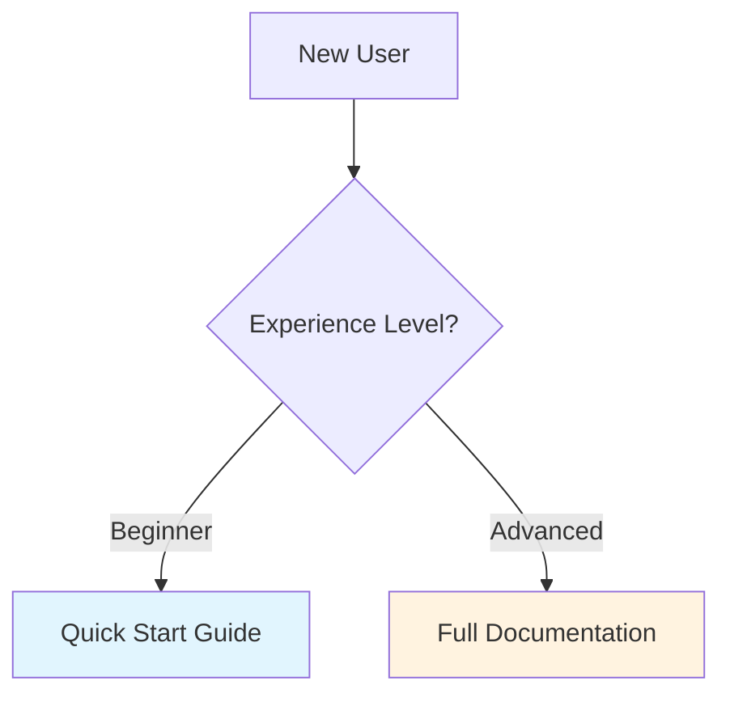
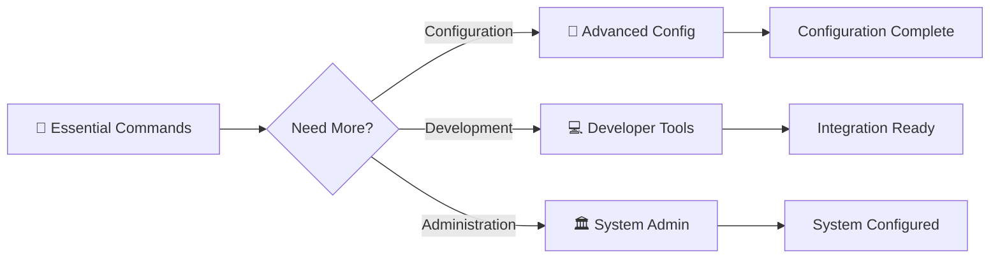

# MkDocs Material Formatting Cheatsheet for Claude

**Version**: 1.0  
**Date**: 2025-08-17  
**Purpose**: Comprehensive formatting guidelines to prevent systematic markdown errors in MkDocs Material documentation

---

## 🎯 **Quick Reference for Common Issues**

### **❌ Common Errors → ✅ Correct Solutions**

| Error | Correct Solution | Why It Matters |
|-------|------------------|----------------|
| `<details>` without `markdown="1"` | `<details markdown="1">` | Enables markdown processing inside HTML tags |
| Missing blank line after headers | Always add blank line before tables/lists | Python Markdown requires separation |
| Narrow table columns | Use CSS: `th:nth-child(1) { width: 25%; }` | Improves readability and prevents text wrapping |
| Headers without spaces | `##Header` → `## Header` | Ensures proper header recognition |
| Code blocks without language | ```` → ```python` | Enables syntax highlighting |

---

## 📋 **Essential MkDocs Material Requirements**

### **Required Extensions in mkdocs.yml**

```yaml
markdown_extensions:
  # Core formatting
  - abbr
  - admonition
  - attr_list
  - def_list
  - footnotes
  - meta
  - md_in_html          # ⭐ REQUIRED for <details> tags
  - toc:
      permalink: true
  - tables

  # PyMdown Extensions
  - pymdownx.arithmatex:
      generic: true
  - pymdownx.betterem
  - pymdownx.caret
  - pymdownx.mark
  - pymdownx.tilde
  - pymdownx.details    # ⭐ REQUIRED for collapsible sections
  - pymdownx.emoji:
      emoji_index: !!python/name:material.extensions.emoji.twemoji
      emoji_generator: !!python/name:material.extensions.emoji.to_svg
  - pymdownx.highlight:
      anchor_linenums: true
      line_spans: __span
      pygments_lang_class: true
  - pymdownx.superfences:  # ⭐ REQUIRED for Mermaid diagrams
      custom_fences:
        - name: mermaid
          class: mermaid
          format: !!python/name:pymdownx.superfences.fence_code_format
  - pymdownx.tabbed:
      alternate_style: true
  - pymdownx.tasklist:
      custom_checkbox: true
```

### **Theme Configuration for Progressive Disclosure**

```yaml
theme:
  name: material
  features:
    - navigation.sections
    - navigation.expand
    - navigation.top
    - search.highlight
    - search.share
    - content.code.copy
    - content.code.annotate

extra_css:
  - stylesheets/extra.css  # ⭐ REQUIRED for table styling

extra_javascript:
  - javascripts/progressive-disclosure.js  # ⭐ OPTIONAL for expand/collapse all
```

---

## 🔧 **HTML5 Details Tags (Progressive Disclosure)**

### **✅ Correct Syntax**

```markdown
<details markdown="1">
<summary>🔧 **Section Title**</summary>

Content goes here with **full markdown support**.

- Lists work properly
- Tables render correctly
- Code blocks are highlighted

```python
# Code blocks work inside details
def example():
    return "Hello, World!"
```

</details>
```

### **❌ Common Errors**

```markdown
<!-- WRONG: Missing markdown attribute -->
<details>
<summary>Section Title</summary>
**This markdown won't render**
</details>

<!-- WRONG: No blank line after summary -->
<details markdown="1">
<summary>Section Title</summary>
Content immediately after summary breaks formatting

<!-- WRONG: Missing markdown="1" -->
<details>
<summary>Section Title</summary>
- Lists don't work
- Tables don't render
</details>
```

### **Progressive Disclosure Best Practices**

1. **Maximum 2-3 Levels**: Avoid deeply nested sections (users get lost)
2. **Clear Summaries**: Use descriptive titles with emojis for visual distinction
3. **Content Organization**: Essential information always visible, advanced content collapsible
4. **Consistent Structure**: Use same pattern across all documentation

```markdown
## **Essential Information** (Always Visible)
Basic information every user needs immediately.

<details markdown="1">
<summary>🔧 **Advanced Configuration**</summary>

Advanced options for power users.

</details>

<details markdown="1">
<summary>💻 **Developer Integration**</summary>

Technical integration details for developers.

</details>
```

---

## 📊 **Table Formatting**

### **✅ Correct Table Syntax**

```markdown
## Table Headers

⚠️ **CRITICAL**: Always add blank line after headers before tables

| Parameter | Type | Required | Description |
|-----------|------|----------|-------------|
| `name` | string | Yes | Model name identifier |
| `version` | string | No | Model version number |
| `config` | object | No | Configuration options |
```

### **❌ Common Table Errors**

```markdown
<!-- WRONG: No blank line after header -->
## Table Headers
| Parameter | Type | Required | Description |
|-----------|------|----------|-------------|

<!-- WRONG: Inconsistent column separators -->
| Parameter| Type |Required| Description|
|----------|------|--------|-----------|

<!-- WRONG: Missing header separator -->
| Parameter | Type | Required | Description |
| name | string | Yes | Model name |
```

### **Responsive Table CSS (Add to extra.css)**

```css
/* Fix narrow Parameter column issues */
.md-typeset table:not([class]) th:nth-child(1) {
    width: 25%;           /* Parameter column */
    min-width: 140px;
}

.md-typeset table:not([class]) th:nth-child(2) {
    width: 15%;           /* Type column */
}

.md-typeset table:not([class]) th:nth-child(3) {
    width: 15%;           /* Required column */
}

.md-typeset table:not([class]) th:nth-child(4) {
    width: 45%;           /* Description column */
}

/* Responsive table wrapper */
.md-typeset table:not([class]) {
    font-size: 0.9rem;
    line-height: 1.4;
    table-layout: fixed;
    width: 100%;
}

/* Text wrapping for long content */
.md-typeset table:not([class]) td {
    word-wrap: break-word;
    overflow-wrap: break-word;
}
```

---

## 📝 **Blank Line Requirements**

### **Critical Blank Line Rules**

1. **After Headers**: Always add blank line before tables, lists, or code blocks
2. **Between Sections**: Separate major sections with blank lines
3. **Around Code Blocks**: Blank lines before and after code blocks
4. **Before Details Tags**: Blank line before `<details>` tags

```markdown
## Header Example

⚠️ Blank line required here before content

| Table | Works |
|-------|-------|
| With  | Blank |

Another blank line here before next section

<details markdown="1">
<summary>Details Example</summary>

Content with proper spacing.

</details>

Final blank line before next major section
```

---

## 🎨 **Code Block Formatting**

### **✅ Always Specify Language**

```markdown
```python
def process_data(input_file):
    """Process neuroimaging data."""
    return processed_data
```

```bash
# CLI commands with proper highlighting
emuses analyze --input brain_data.csv --output results/
```

```yaml
# Configuration files
configuration:
  model_path: "/path/to/model"
  batch_size: 32
```
```

### **❌ Avoid Generic Code Blocks**

```markdown
<!-- WRONG: No language specified -->
```
def example():
    return "No highlighting"
```

<!-- WRONG: Using generic 'code' -->
```code
emuses --help
```
```

---

## 🎯 **Accessibility Guidelines**

### **Screen Reader Support**

```markdown
<!-- ✅ GOOD: Descriptive summary with semantic markup -->
<details markdown="1">
<summary>
<strong>Advanced Configuration Options</strong>  
<em>Expand to view detailed configuration parameters</em>
</summary>

Detailed configuration content here.

</details>

<!-- ❌ BAD: Non-descriptive or missing context -->
<details markdown="1">
<summary>More</summary>
Content without context.
</details>
```

### **ARIA Enhancement (Optional)**

```html
<details markdown="1" role="group" aria-labelledby="config-summary">
<summary id="config-summary">Advanced Configuration</summary>

Content with enhanced accessibility.

</details>
```

---

## 🔄 **Mermaid Diagram Integration**

### **✅ Correct Mermaid Syntax**

```markdown

```

### **Progressive Disclosure Navigation Example**

```markdown

```

---

## 🛠️ **CSS Styling for Progressive Disclosure**

### **Enhanced Details Styling (Add to extra.css)**

```css
/* Progressive disclosure enhancements */
.md-typeset details {
    margin: 1.5rem 0;
    border-radius: 0.25rem;
    border: 1px solid var(--md-default-fg-color--lightest);
}

.md-typeset details summary {
    font-weight: 600;
    margin-bottom: 1rem;
    cursor: pointer;
    padding: 0.75rem 1rem;
    background-color: var(--md-default-bg-color--light);
    border-radius: 0.25rem 0.25rem 0 0;
    transition: background-color 0.2s ease;
}

.md-typeset details summary:hover {
    background-color: var(--md-accent-fg-color--transparent);
}

.md-typeset details[open] summary {
    border-bottom: 1px solid var(--md-default-fg-color--lightest);
    border-radius: 0.25rem 0.25rem 0 0;
}

.md-typeset details[open] {
    background-color: var(--md-code-bg-color);
}

/* Content inside details */
.md-typeset details > *:not(summary) {
    padding: 0 1rem 1rem 1rem;
}
```

---

## 🔍 **Automated Validation Setup**

### **Link Validation (mkdocs.yml)**

```yaml
plugins:
  - search
  - minify:
      minify_html: true
  - linkcheck:          # Automated link validation
      anchors: true
      timeout: 30
      retries: 3
      ignore:
        - 'localhost:*'
        - '127.0.0.1:*'
      external_only: false

# Enable strict mode for production
strict: true

validation:
  nav:
    not_found: warn
    absolute_links: info
  links:
    not_found: warn
    anchors: info
    unrecognized_links: info
```

### **Pre-commit Hook Configuration**

```yaml
# .pre-commit-config.yaml
repos:
  - repo: local
    hooks:
      - id: mkdocs-linkcheck
        name: Check documentation links
        entry: mkdocs build --strict
        language: system
        files: '^docs/.*\.md$'
        pass_filenames: false
      
      - id: markdownlint
        name: Lint Markdown files
        entry: markdownlint
        language: node
        files: '^docs/.*\.md$'
        additional_dependencies: ['markdownlint-cli']
```

### **GitHub Actions Validation**

```yaml
# .github/workflows/docs-validation.yml
name: Documentation Validation

on:
  pull_request:
    paths: ['docs/**', 'mkdocs.yml']

jobs:
  validate-docs:
    runs-on: ubuntu-latest
    steps:
      - uses: actions/checkout@v4
      
      - name: Setup Python
        uses: actions/setup-python@v4
        with:
          python-version: '3.x'
      
      - name: Install dependencies
        run: |
          pip install mkdocs mkdocs-material mkdocs-linkcheck
          npm install -g markdownlint-cli
      
      - name: Validate markdown syntax
        run: markdownlint docs/
      
      - name: Validate links and build
        run: mkdocs build --strict --verbose
      
      - name: Test progressive disclosure features
        run: |
          if grep -q '<details markdown="1">' site/*/index.html; then
            echo "✅ Progressive disclosure implemented correctly"
          else
            echo "❌ Progressive disclosure issues detected"
            exit 1
          fi
```

---

## 📚 **Content Organization Patterns**

### **Document Structure Template**

```markdown
# 📖 Document Title

## **Essential Information** (Always Visible)
Critical information that all users need immediately:
- Basic setup steps
- Most common use cases
- Quick reference examples

## **Quick Examples** (Always Visible)
Copy-paste examples for immediate value:

```bash
# Most common workflow
emuses analyze --input data.csv --output results/
```

<details markdown="1">
<summary>🔧 **Advanced Configuration**</summary>

Advanced customization options for power users:
- Performance tuning
- Custom configurations
- Optimization strategies

### Configuration Examples

```yaml
# Advanced configuration
advanced_settings:
  memory_limit: "16GB"
  parallel_jobs: 8
```

</details>

<details markdown="1">
<summary>💻 **Developer Integration**</summary>

Technical integration details for developers:
- API endpoints
- Code examples
- Integration patterns

### API Integration

```python
# Developer code examples
from emuses import ModelRegistry
registry = ModelRegistry()
```

</details>

<details markdown="1">
<summary>🏛️ **System Administration**</summary>

Administrative functions and deployment:
- Production deployment
- Monitoring setup
- Security configuration

</details>
```

---

## ⚡ **Performance Optimization**

### **Build Performance Tips**

1. **Limit TOC Depth**: Set `toc_depth: 3` to prevent excessive processing
2. **Optimize Images**: Use compressed images and proper formats
3. **Minimize Extensions**: Only enable needed markdown extensions
4. **Cache Configuration**: Use MkDocs native caching for faster builds

```yaml
# Performance optimizations
markdown_extensions:
  - pymdownx.highlight:
      guess_lang: false    # Improves performance
      linenums: false      # Reduces processing overhead
      
  - toc:
      toc_depth: 3         # Limits table of contents depth
```

---

## 🚨 **Troubleshooting Common Issues**

### **Details Tags Not Rendering Markdown**

**Problem**: Content inside `<details>` tags appears as plain text

**Solution**: Add `markdown="1"` attribute and ensure `md_in_html` extension is enabled

```markdown
<!-- ❌ WRONG -->
<details>
<summary>Title</summary>
**This won't be bold**
</details>

<!-- ✅ CORRECT -->
<details markdown="1">
<summary>Title</summary>

**This will be bold**

</details>
```

### **Tables Not Rendering**

**Problem**: Table appears as plain text instead of formatted table

**Solutions**:
1. Ensure blank line after header before table
2. Check table syntax (consistent column separators)
3. Verify tables extension is enabled

### **Mermaid Diagrams Not Showing**

**Problem**: Mermaid code blocks appear as text

**Solutions**:
1. Ensure `pymdownx.superfences` is configured with mermaid custom fence
2. Check diagram syntax is valid
3. Verify Material theme supports Mermaid (it does natively)

### **Build Failures with Strict Mode**

**Problem**: `mkdocs build --strict` fails with warnings

**Solutions**:
1. Fix all broken links (use linkcheck plugin)
2. Ensure all referenced images exist
3. Validate markdown syntax with markdownlint

---

## 📋 **Quality Assurance Checklist**

### **Before Committing Documentation**

- [ ] All `<details>` tags have `markdown="1"` attribute
- [ ] Blank lines exist after headers before tables/lists
- [ ] Tables have consistent column separators
- [ ] Code blocks specify language (python, bash, yaml, etc.)
- [ ] Images have alt text for accessibility
- [ ] Links are tested and valid
- [ ] Mermaid diagrams render correctly
- [ ] Progressive disclosure levels don't exceed 2-3 levels
- [ ] Content follows beginner → advanced hierarchy

### **Automated Validation Commands**

```bash
# Local validation before push
markdownlint docs/
mkdocs build --strict
mkdocs serve  # Test locally

# Link checking
mkdocs build --strict --verbose 2>&1 | grep -i "warning\|error"
```

---

## 🎯 **Integration with LAD Framework**

### **Adding to LAD Prompts**

Reference this cheatsheet in Claude prompts:

> "When creating or editing MkDocs Material documentation, always follow the formatting guidelines in `MKDOCS_FORMATTING_CHEATSHEET.md`. Key requirements: use `markdown="1"` for details tags, add blank lines after headers before tables, specify languages for code blocks, and maintain progressive disclosure best practices."

### **LAD Context Integration**

Add to `.lad/CLAUDE.md`:

```markdown
## Documentation Standards
- **Formatting Reference**: `docs/documentation-restructuring/MKDOCS_FORMATTING_CHEATSHEET.md`
- **Required**: Always validate with markdownlint and mkdocs build --strict
- **Progressive Disclosure**: Maximum 2-3 levels, essential content always visible
- **Accessibility**: Descriptive summaries, proper ARIA when needed
```

---

**🎯 This cheatsheet addresses all systematic formatting errors identified in the progressive disclosure implementation and provides a comprehensive reference for error-free MkDocs Material documentation creation.**

---

*Last Updated: 2025-08-17*  
*Created for EMUSES progressive disclosure documentation system*  
*Comprehensive research-based guidelines for Claude and development team*