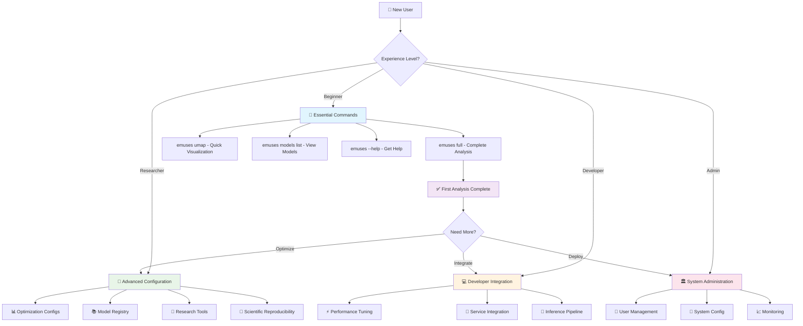

# 🛠️ EMUSES CLI Complete Reference

**Comprehensive command-line interface reference for EMUSES scientific analysis platform**

This reference provides progressive disclosure documentation - essential commands are always visible, while advanced features are organized in collapsible sections for different expertise levels.

## 🗺️ **CLI Command Navigation Map**



---

## **🚀 Essential Commands** 
*Start here - core commands every user needs*

### Quick Command Reference
```bash
emuses --help                    # Get comprehensive help
emuses full my_analysis/ data.csv --scores scores.csv  # Complete analysis
emuses umap embeddings/ data.csv # Just dimensionality reduction
emuses models list              # View available models
```

### `emuses full` - Complete Pipeline Analysis

Run the complete EMUSES analysis pipeline with sensible defaults.

**Basic Usage**
```bash
emuses full my_analysis/ brain_features.csv --scores cognitive_scores.csv
```

**Essential Parameters**
| Parameter | Type | Required | Description |
|-----------|------|----------|-------------|
| `OUTPUT_FOLDER` | path | ✅ Required | Directory for analysis results |
| `INPUT_DATASET` | path | ✅ Required | CSV file with scientific features |
| `--scores` | path | ✅ Essential | CSV file with cognitive/behavioral scores |

**Your First Analysis** (5 minutes)
```bash
# Using sample data (replace with your data files)
emuses full my_first_analysis/ \
  docs/examples/sample_data/hcp_input_data.csv \
  --scores docs/examples/sample_data/hcp_labels.csv
```
*Expected runtime: 3-5 minutes with sample data*  
*Output: Complete analysis results in `my_first_analysis/` folder*

### `emuses umap` - Dimensionality Reduction Only

Create UMAP embeddings for data visualization and exploration.

**Basic Usage**
```bash
emuses umap embeddings_output/ brain_features.csv
```

**When to Use**
- **Exploratory analysis**: Quick visualization of high-dimensional data
- **Quality control**: Check data clustering before full analysis
- **Preprocessing**: Create embeddings for downstream analysis

---

## ♻️ **Reusing Work Between Runs**

The morphospace and the prediction search are reused separately, and the rules
differ. Both are worth knowing before you point a run at a folder that already
has results in it.

### Reusing a morphospace

**Explicitly, with `--load_umap`** — the recommended route:

```bash
# Build the morphospace once
emuses umap morphospace/ features.csv

# Reuse it later, with labelled data, to build prediction models
emuses full analysis/ features.csv --scores scores.csv --load_umap morphospace/
```

`--load_umap` accepts the run folder or the model file. It does **not** fall back
to training if the path is unusable — it fails, because reusing a specific
morphospace and building a new one are different experiments.

**Implicitly, by reusing an output folder.** If a folder already contains a UMAP
model, a clusterer, embeddings and cluster labels, a new run into that folder
loads them and skips UMAP training. This is easy to trigger by accident, so the
run logs `Found existing output files` when it happens. Use a fresh folder, or
`--load_umap`, when you want to be sure which morphospace you got.

**Cluster labels and cohorts.** Coordinates are always re-derived for the current
subjects. Cluster labels are only reused when `cohort.json` confirms the cohort
is unchanged; otherwise they are re-derived from the saved clusterer. A folder
written before `cohort.json` existed cannot confirm anything, so its labels are
re-derived rather than trusted. `cohort.json` stores **no subject identifiers** by
default — only a digest of the feature matrix — because the model folder is what
you share. `--record_cohort_ids` adds them if you can share them.

### Reusing the prediction search — `--resume_targets`

The nested-CV search is the expensive half of EMUSES. Targets are independent, so
an interrupted run can pick up a target at a time:

```bash
emuses full analysis/ features.csv --scores scores.csv --resume_targets
```

Opt-in on purpose. A target is reused only when everything that determined its
result is unchanged: the coordinates, the target values, the search space, the
fold count, the trial budget and the seeds. Change `--optuna_trials` or
`--prediction_optim_dict` and the stored result is rejected and re-run.

Resuming is per **target**, not per fold — a target interrupted midway is redone.

### Telling several runs apart in one folder

`performance_summary/` keeps one timestamped pair of CSVs per run, and the
per-target CSVs under `target_N/performance/` are overwritten by whichever run
went last. `performance_summary/runs.json` records what each run was —
embedding width, search spaces, budgets, seeds — with `latest` naming the current
results. Read it before comparing numbers from a folder that has been run more
than once.

### `emuses models list` - View Available Models

List all models in your registry with completeness indicators.

```bash
emuses models list                    # List all models
emuses models list --workspace lab1   # Filter by workspace
```

**Output Format**:
```
✅ brain_classifier_v2_abc123 (Complete) - Brain classification model
⚠️  legacy_umap_model_def456 (Incomplete) - Individual UMAP component
✅ hcp_analysis_v1_ghi789 (Complete) - HCP task analysis
```

### `emuses --help` - Get Help

Get comprehensive help for any command.

```bash
emuses COMMAND --help           # Get help for any command
emuses models SUBCOMMAND --help # Get help for subcommands
```

---

<details markdown="1">
<summary>🔧 **Advanced Configuration Commands**</summary>

### Understanding Optimization Configurations (`optim_dict`)

EMUSES uses sophisticated optimization configurations instead of direct parameter exposure. This provides better results while maintaining simplicity.

#### What is `optim_dict`?
The `--optim_dict` parameter references predefined optimization configurations that control:
- **UMAP parameters**: n_neighbors, min_dist, metric selection
- **HDBSCAN parameters**: min_cluster_size, min_samples  
- **Optimization metrics**: How to evaluate parameter quality
- **Search strategies**: How to explore parameter space

#### Available Preset Configurations

**`optim_dict_default`** - Balanced optimization (Default)
- Good for most neuroimaging datasets
- Moderate exploration of parameter space
- Balances clustering quality with speed

**`optim_dict_hcp`** - Optimized for HCP-style data
- Best for high-quality, preprocessed neuroimaging data  
- Fixed parameters proven effective on HCP datasets
- Faster execution with known-good settings

**`optim_dict_range`** - Better for noisy data
- Broader parameter exploration 
- Less focus on entropy optimization (hard to optimize with noisy data)
- More robust clustering for challenging datasets

**`optim_dict_hard`** - Intensive optimization
- Narrower n_neighbors exploration (5-45 → 5-45 with step 20)
- Slightly lower entropy focus for more stable optimization
- Longer runtime but potentially better results

### `emuses full` - Complete Parameter Reference

#### Data Input Parameters
| Parameter | Type | Default | Description |
|-----------|------|---------|-------------|
| `OUTPUT_FOLDER` | path | - | **Required.** Analysis results directory |
| `INPUT_DATASET` | path | - | **Required.** Scientific features CSV |
| `--scores` | path | None | **Essential.** Behavioral/cognitive scores CSV |
| `--label-dataset` | path | None | Additional labeled dataset |

#### Optimization Configuration  
| Parameter | Type | Default | Description |
|-----------|------|---------|-------------|
| `--optim_dict` | string | optim_dict_default | Optimization configuration preset |
| `--umap_trials` | integer | 50 | Number of UMAP optimization trials |
| `--hdbscan_trials` | integer | 20 | Number of HDBSCAN optimization trials |

#### Execution Control
| Parameter | Type | Default | Description |
|-----------|------|---------|-------------|
| `--test_size` | float | 0.2 | Train/test split ratio |
| `--random_state` | integer | 42 | Random seed for reproducibility |
| `--n_jobs` | integer | -1 | Parallel processing (-1 = all cores) |

#### Advanced Features
| Parameter | Type | Default | Description |
|-----------|------|---------|-------------|
| `--use_enhanced_pipeline` | flag | False | Enable Optuna model optimization |
| `--optuna_trials` | integer | 60 | Optuna optimization trials per model |
| `--interactive` | flag | False | Interactive mode with prompts |

### Advanced Examples

**HCP-Optimized Analysis**
```bash
emuses full hcp_analysis/ \
  brain_connectivity.csv \
  --scores fluid_intelligence.csv \
  --optim_dict optim_dict_hcp \
  --random_state 42
```

**Noisy Data Analysis**
```bash
emuses full noisy_data_analysis/ \
  messy_brain_features.csv \
  --scores behavioral_scores.csv \
  --optim_dict optim_dict_range \
  --umap_trials 100
```

**Enhanced Pipeline with Model Optimization**
```bash
emuses full comprehensive_analysis/ \
  brain_features.csv \
  --scores cognitive_battery.csv \
  --use_enhanced_pipeline \
  --optuna_trials 100 \
  --n_jobs 8
```

### `emuses heatmap` - Visualization Generation

Generate correlation heatmaps from existing embeddings.

**Usage**
```bash
emuses heatmap heatmap_output/ embeddings.npy --scores cognitive_scores.csv
```

**Parameters**
| Parameter | Type | Required | Description |
|-----------|------|----------|-------------|
| `OUTPUT_FOLDER` | path | ✅ Required | Directory for heatmap results |
| `EMBEDDINGS_FILE` | path | ✅ Required | NumPy array file with embeddings |
| `--scores` | path | ✅ Essential | CSV file with scores for correlation |

</details>

<details markdown="1">
<summary>📚 **Model Registry and Collaboration**</summary>

### Complete Model Registry Commands

The Model Registry now supports **Complete EMUSES Models** - unified models containing UMAP, HDBSCAN, and inference components for streamlined workflows.

#### `emuses models install` - Register New Models
```bash
# Install complete model (auto-detects all components)
emuses models install complete_model_directory/ --name "Brain Age Predictor v2"

# Install individual component (legacy support)
emuses models install single_model.pkl --name "UMAP Component"
```

#### `emuses models list` - List Models with Completeness
```bash
emuses models list                    # Show all models with ✅/⚠️ indicators
emuses models list --complete-only    # Show only complete models
```

#### `emuses models components` - **NEW** Inspect Model Components
```bash
emuses models components brain_classifier_v2_abc123
# Output:
# UMAP Model: /path/to/umap_model.joblib (2.3 MB)
# HDBSCAN Model: /path/to/hdbscan_model.joblib (0.8 MB) 
# Inference Model: /path/to/inference_model.joblib (1.5 MB)
```

#### `emuses models info` - Get Model Details
```bash
emuses models info model_id_or_name    # Enhanced with component information
```

#### `emuses models deduplicate` - **NEW** Clean Up Duplicates
```bash
emuses models deduplicate              # Interactive duplicate resolution
```

#### `emuses models search` - Find Models
```bash
emuses models search "motor cortex"    # Search model descriptions
emuses models search --complete-only   # Find only complete models
```

#### `emuses models remove` - Delete Models
```bash
emuses models remove model_id_or_name
```

#### `emuses models status` - Registry Health Check
```bash
emuses models status                   # Show registry statistics and health
```

#### `emuses models storage` - Storage Usage
```bash
emuses models storage                  # View storage usage and statistics
```

### Workspace Management Commands

#### `emuses workspace create` - Create Team Workspace
```bash
emuses workspace create "Lab Analysis" \
  --description "Shared workspace for lab analysis projects"
```

#### `emuses workspace list` - View Available Workspaces
```bash
emuses workspace list
```

#### `emuses workspace switch` - Change Active Workspace
```bash
emuses workspace switch workspace_name_or_id
```

### Research Reproducibility Commands

#### `emuses verify` - Verify Analysis Results
```bash
emuses verify analysis_directory/
```

#### `emuses info` - Get Analysis Information
```bash
emuses info analysis_directory/
```

#### `emuses cite` - Generate Citations
```bash
emuses cite analysis_directory/ --format bibtex
```

#### `emuses trace` - Track Analysis Lineage
```bash
emuses trace analysis_directory/
```

#### `emuses reproduce` - Reproduce Analysis
```bash
emuses reproduce analysis_directory/ new_output/
```

#### `emuses diff` - Compare Analyses
```bash
emuses diff analysis1/ analysis2/
```

#### `emuses compare` - Compare Multiple Results
```bash
emuses compare analysis1/ analysis2/ analysis3/
```

#### `emuses rerun` - Rerun Analysis
```bash
emuses rerun analysis_directory/ --update-data
```

</details>

<details markdown="1">
<summary>💻 **Developer and Integration Commands**</summary>

### Service Integration

#### Service-Based Execution
```bash
emuses full distributed_analysis/ \
  brain_features.csv \
  --scores cognitive_scores.csv \
  --service \
  --service-url https://emuses-cluster.institution.edu \
  --token $EMUSES_TOKEN \
  --service-timeout 7200
```

#### Service Integration Parameters
| Parameter | Type | Default | Description |
|-----------|------|---------|-------------|
| `--service` | flag | False | Use remote service execution |
| `--service-url` | string | None | Remote service URL |
| `--token` | string | None | Authentication token |
| `--service-timeout` | integer | 3600 | Request timeout in seconds |

### Performance Optimization

#### High-Performance Analysis Setup
```bash
emuses full large_study_analysis/ \
  massive_dataset.csv \
  --scores comprehensive_battery.csv \
  --optim_dict optim_dict_hard \
  --umap_trials 200 \
  --optuna_trials 150 \
  --n_jobs 16
```

#### Resource Management Parameters
| Parameter | Type | Default | Description |
|-----------|------|---------|-------------|
| `--n_jobs` | integer | -1 | Parallel processing jobs (-1 = all cores) |
| `--umap_jobs` | integer | None | UMAP-specific parallel jobs |
| `--hdbscan_jobs` | integer | None | HDBSCAN-specific parallel jobs |
| `--parallel_model_training` | flag | False | Enable parallel model training |

### `emuses inference` - Run Predictions

Run inference on new data using trained EMUSES models with registry support.

**Registry Model Inference** (Recommended)
```bash
# Use registry model ID - runs complete EMUSES folder pipeline
emuses inference inference_output/ new_patient_features.csv \
  --model-id brain_classifier_v2_abc123
```

**Direct Path Inference** (Traditional)
```bash
# Direct EMUSES folder path usage
emuses inference results/ new_data.csv \
  --model /path/to/emuses/folder
```

**Registry Model Parameters**

| Parameter | Type | Required | Description |
|-----------|------|----------|-------------|
| `OUTPUT` | path | ✅ Required | Directory for inference results |
| `DATA` | path | ✅ Required | New data for inference (CSV) |
| `--model-id` | string | ✅ Required* | Registry model ID for EMUSES folder |

**Direct Path Parameters**

| Parameter | Type | Required | Description |
|-----------|------|----------|-------------|
| `OUTPUT` | path | ✅ Required | Directory for inference results |
| `DATA` | path | ✅ Required | New data for inference (CSV) |
| `--model` | path | ✅ Required* | Path to EMUSES training folder |

*Note: Exactly one of `--model-id` or `--model` must be provided.

**Preprocessing parameters must match the training run**

Inference applies the scalers saved with the model, so the new data has to be read and scaled the
same way the training data was. These flags are accepted by `emuses inference` and default to the
same values as training: `--input_header`, `--input_index_column`, `--columns_are_features`,
`--input_normalization`, `--inputs_columns`, `--classification`, and the `--scores*` options for
validation mode.

| Situation | Flag |
|---|---|
| Your CSV has a header row | `--input_header 0` — without it the load fails with "No numeric data remaining after processing the file" |
| Your CSV has row labels or IDs in the first column | `--input_index_column 0` |
| The model was trained with `--columns_are_features` / `--input_normalization robust` | pass the same flags |

Do **not** feed a model its own `split_dataset/*.npy` files back in. Those are written *after*
normalization, and the inference path normalizes again, which silently moves the samples off the
manifold the UMAP was fitted on.

**Where inference runs.** Like every other command, `emuses inference` submits a job to the EMUSES
service (a local one is auto-started if none is running), so a model on a server can be used by
people who did not train it. `--service-url` points at a remote service.

**Example Workflows**
```bash
# Registry workflow - from model discovery to inference
emuses models list                    # Find available EMUSES models
emuses models info model_id          # Inspect model details and components  
emuses inference results/ data.csv --model-id model_id

# Direct path workflow - using folder paths
emuses inference results/ data.csv --model /path/to/emuses/folder
```

### Shell Integration

#### `emuses install-completion` - Enable Tab Completion
```bash
emuses install-completion
```

Enables tab completion for your shell (bash, zsh, fish).

</details>

<details markdown="1">
<summary>🏛️ **System Administration**</summary>

### Custom Optimization Configuration

Advanced users can create custom `optim_dict` configurations by understanding the internal structure.

#### Configuration Structure
```python
{
    "param": {
        "umap": {
            "min_dist": {"name": "min_dist", "low": 0.0, "high": 0.5},
            "n_neighbors": {"name": "n_neighbors", "low": 5, "high": 45, "step": 10},
            "n_components": {"value": 2},  # Fixed at 2D
            "metric": {"name": "metric", "choices": ["euclidean"]}
        },
        "hdbscan": {
            "min_cluster_size": {"name": "min_cluster_size", "low": 5, "high": 50},
            "min_samples": {"name": "min_samples", "low": 1, "high": 10}
        }
    },
    "metrics": {
        "umap": {
            "eigen_spread": {"weight": 2.0},
            "density_variability": {"weight": 1.0, "target": 0.4, "epsilon": 0.2},
            "entropy": {"weight": 3.0, "target": 0.6, "epsilon": 0.25}
        },
        "hdbscan": {
            "cluster_persistence": {"weight": 2},
            "noise_ratio": {"weight": 1.0, "target": 0.9, "epsilon": 0.05},
            "dbcv": {"weight": 1.0, "target": 1, "epsilon": 0.5}
        }
    }
}
```

#### Parameter Types
- **Range parameters**: `{"low": X, "high": Y}` - Continuous optimization range
- **Step parameters**: `{"low": X, "high": Y, "step": Z}` - Discrete steps  
- **Choice parameters**: `{"choices": [A, B, C]}` - Categorical selection
- **Fixed parameters**: `{"value": X}` - No optimization

#### Metric Optimization
- **weight**: Importance of this metric in overall score
- **target**: Desired value for the metric  
- **epsilon**: Tolerance around target value

### Administrative Commands

**Multi-user service administration with enterprise security (Vault integration supported)**

#### `emuses admin add-user` - Create System User
```bash
# Create user with email and password
emuses admin add-user researcher@company.com --password SecurePass123

# Create user with organization
emuses admin add-user postdoc@lab.edu -p MyPass456 -o "Neuroscience Lab"

# Create inactive user for later activation
emuses admin add-user intern@college.edu -p TempPass789 --inactive
```

#### `emuses admin list-users` - List All Users
```bash
# Default listing (10 users)
emuses admin list-users

# Extended listing with pagination
emuses admin list-users --limit 50 --skip 20
```

#### `emuses admin system-status` - Monitor System Health  
```bash
# Quick health check
emuses admin system-status

# Detailed diagnostic information
emuses admin system-status --detailed
```

#### `emuses admin set-quota` - Manage Resource Limits
```bash
# Set storage quota (GB)
emuses admin set-quota user@example.com storage_gb 50

# Set concurrent job limit
emuses admin set-quota user@example.com concurrent_jobs 2

# Set compute hour limit
emuses admin set-quota user@example.com compute_hours 500
```

#### `emuses admin cancel-job` - Cancel Running Jobs
```bash
# Cancel with confirmation
emuses admin cancel-job 12345678-1234-1234-1234-123456789abc

# Force cancellation (no confirmation)
emuses admin cancel-job abcd1234-5678-90ef-ghij-klmnopqrstuv --force
```

#### `emuses admin help` - Comprehensive Admin Help
```bash
# Display comprehensive admin guidance
emuses admin help
```

### Model Registry Administration

#### `emuses models cleanup` - Clean Registry Storage
```bash
# Preview cleanup operations
emuses models cleanup --dry-run

# Clean orphaned files and temporary data
emuses models cleanup
```

#### `emuses models mode-info` - Registry Configuration
```bash
# Check registry deployment mode and configuration
emuses models mode-info
```

#### `emuses models api-info` - API Integration Status
```bash
# View API configuration for database/cloud modes
emuses models api-info
```

**📚 For detailed usage examples and troubleshooting:** [Admin Guide →](multi-user-service/admin-guide.md)

---

## 🔬 **Scientific Reproducibility Commands**

<details>
<summary>🧬 **Advanced Research Tools** - Model Provenance & Citation</summary>

### `emuses trace` - Export Model Provenance

Export complete model provenance for supplementary materials and scientific reproducibility.

```bash
# Export provenance for a specific model
emuses trace trained_model_dir

# Export to custom location
emuses trace trained_model_dir --output model_provenance.json
```

**Parameters:**
| Parameter | Type | Required | Description |
|-----------|------|----------|-------------|
| `MODEL` | path/name | ✅ Required | Path to model directory or model name |
| `--output` | path | ⚪ Optional | Output file path (default: {model_name}_trace.json) |

**Output:** JSON file containing complete model provenance including training context, random seeds, environment details, and reproducibility metadata.

### `emuses cite` - Generate Publication Citations

Generate publication-ready citations for models in multiple academic formats.

```bash
# Generate BibTeX citation (default)
emuses cite trained_model_dir

# Generate APA format citation
emuses cite trained_model_dir --format apa

# Generate Nature journal format
emuses cite trained_model_dir --format nature
```

**Parameters:**
| Parameter | Type | Required | Description |
|-----------|------|----------|-------------|
| `MODEL` | path/name | ✅ Required | Path to model directory or model name |
| `--format` | choice | ⚪ Optional | Citation format: `bibtex`, `apa`, `nature` (default: bibtex) |

**Output:** Formatted citation text ready for academic publications.

### `emuses reproduce` - Generate Reproduction Guides

Create comprehensive markdown guides for exact model reproduction.

```bash
# Generate reproduction guide in model directory
emuses reproduce trained_model_dir

# Generate guide to custom location
emuses reproduce trained_model_dir --output reproduction_manual.md
```

**Parameters:**
| Parameter | Type | Required | Description |
|-----------|------|----------|-------------|
| `MODEL` | path/name | ✅ Required | Path to model directory or model name |
| `--output` | path | ⚪ Optional | Output file path (default: {model_dir}/reproduction_guide.md) |

**Output:** Complete markdown reproduction guide with environment setup, exact commands, and verification steps.

### `emuses diff` - Check Model Modifications

Detect modifications to model files since creation using manifest checksums.

```bash
# Quick change detection
emuses diff trained_model_dir

# Detailed change information with file sizes and checksums
emuses diff trained_model_dir --detailed
```

**Parameters:**
| Parameter | Type | Required | Description |
|-----------|------|----------|-------------|
| `MODEL` | path/name | ✅ Required | Path to model directory or model name |
| `--detailed` | flag | ⚪ Optional | Show detailed change information including checksums |

**Output:** Report of modified, added, or deleted files compared to original manifest.

### `emuses compare` - Compare Model Versions

Side-by-side comparison of two model versions including configuration and dependencies.

```bash
# Compare two model directories
emuses compare model_v1/ model_v2/
```

**Parameters:**
| Parameter | Type | Required | Description |
|-----------|------|----------|-------------|
| `MODEL1` | path | ✅ Required | Path to first model directory |
| `MODEL2` | path | ✅ Required | Path to second model directory |

**Output:** Comprehensive comparison report showing manifest differences, configuration changes, and dependency updates.

### `emuses rerun` - Re-execute Previous Commands

Re-execute previously saved commands from their output folders for exact reproduction.

```bash
# Rerun command from output folder
emuses rerun /path/to/previous/output/
```

**Parameters:**
| Parameter | Type | Required | Description |
|-----------|------|----------|-------------|
| `OUTPUT_FOLDER` | path | ✅ Required | Path to output folder containing saved command |

**Output:** Re-executes the exact command that was previously run, maintaining reproducibility.

</details>

---

### Advanced System Configuration

#### Multi-User Environment Setup
```bash
# Initialize multi-user mode
emuses admin init-multiuser \
  --database-url postgresql://localhost/emuses \
  --redis-url redis://localhost:6379 \
  --storage-path /shared/emuses-data

# Configure authentication
emuses admin configure-auth \
  --provider ldap \
  --server ldap.institution.edu \
  --base-dn "dc=institution,dc=edu"
```

#### Cluster Deployment Configuration
```bash
# Configure distributed processing
emuses admin configure-cluster \
  --scheduler-host cluster-scheduler.local \
  --worker-nodes 8 \
  --resource-limits cpu=32,memory=128GB
```

</details>

---

## 🔗 **Related Documentation**

- **[User Guide](USER_GUIDE.md)** - Complete usage documentation with workflows
- **[API Documentation](API_REFERENCE.md)** - REST API for programmatic access  
- **[Research Workflows](RESEARCH_WORKFLOWS.md)** - Scientific use case patterns
- **[Quick Start](QUICK_START.md)** - 5-minute getting started guide

---

## 💡 **Getting Help**

### Quick Troubleshooting
- **Parameter errors**: Check required vs optional parameters in sections above
- **Data format issues**: Ensure CSV files have proper headers and formatting
- **Performance problems**: Reduce `--umap_trials` and `--optuna_trials` for faster execution
- **Memory issues**: Use `--n_jobs 1` to reduce parallel processing

### Support Resources
- **GitHub Issues**: [Report bugs and request features](https://github.com/chrisfoulon/emuses/issues)
- **Documentation**: [Complete user guides](index.md)
- **Sample Data**: [Example datasets and workflows](examples/index.md)

---

*This CLI reference uses progressive disclosure - essential commands are immediately visible, while advanced features are organized in collapsible sections. Click any section header to expand detailed information.*