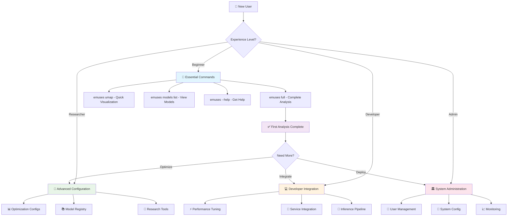

# 🛠️ EMUSES CLI Complete Reference

**Comprehensive command-line interface reference for EMUSES scientific analysis platform**

This reference provides progressive disclosure documentation - essential commands are always visible, while advanced features are organized in collapsible sections for different expertise levels.

## 🗺️ **CLI Command Navigation Map**



---

## **🚀 Essential Commands** 
*Start here - core commands every user needs*

### Quick Command Reference
```bash
emuses --help                    # Get comprehensive help
emuses full my_analysis/ data.csv --scores scores.csv  # Complete analysis
emuses umap embeddings/ data.csv # Just dimensionality reduction
emuses models list              # View available models
```

### `emuses full` - Complete Pipeline Analysis

Run the complete EMUSES analysis pipeline with sensible defaults.

**Basic Usage**
```bash
emuses full my_analysis/ brain_features.csv --scores cognitive_scores.csv
```

**Essential Parameters**
| Parameter | Type | Required | Description |
|-----------|------|----------|-------------|
| `OUTPUT_FOLDER` | path | ✅ Required | Directory for analysis results |
| `INPUT_DATASET` | path | ✅ Required | CSV file with scientific features |
| `--scores` | path | ✅ Essential | CSV file with cognitive/behavioral scores |

**Your First Analysis** (5 minutes)
```bash
# Using sample data (replace with your data files)
emuses full my_first_analysis/ \
  docs/examples/sample_data/hcp_input_data.csv \
  --scores docs/examples/sample_data/hcp_labels.csv
```
*Expected runtime: 3-5 minutes with sample data*  
*Output: Complete analysis results in `my_first_analysis/` folder*

### `emuses umap` - Dimensionality Reduction Only

Create UMAP embeddings for data visualization and exploration.

**Basic Usage**
```bash
emuses umap embeddings_output/ brain_features.csv
```

**When to Use**
- **Exploratory analysis**: Quick visualization of high-dimensional data
- **Quality control**: Check data clustering before full analysis
- **Preprocessing**: Create embeddings for downstream analysis

### `emuses models list` - View Available Models

List all models in your registry.

```bash
emuses models list                    # List all models
emuses models list --workspace lab1   # Filter by workspace
```

### `emuses --help` - Get Help

Get comprehensive help for any command.

```bash
emuses COMMAND --help           # Get help for any command
emuses models SUBCOMMAND --help # Get help for subcommands
```

---

<details markdown="1">
<summary>🔧 **Advanced Configuration Commands**</summary>

### Understanding Optimization Configurations (`optim_dict`)

EMUSES uses sophisticated optimization configurations instead of direct parameter exposure. This provides better results while maintaining simplicity.

#### What is `optim_dict`?
The `--optim_dict` parameter references predefined optimization configurations that control:
- **UMAP parameters**: n_neighbors, min_dist, metric selection
- **HDBSCAN parameters**: min_cluster_size, min_samples  
- **Optimization metrics**: How to evaluate parameter quality
- **Search strategies**: How to explore parameter space

#### Available Preset Configurations

**`optim_dict_default`** - Balanced optimization (Default)
- Good for most neuroimaging datasets
- Moderate exploration of parameter space
- Balances clustering quality with speed

**`optim_dict_hcp`** - Optimized for HCP-style data
- Best for high-quality, preprocessed neuroimaging data  
- Fixed parameters proven effective on HCP datasets
- Faster execution with known-good settings

**`optim_dict_range`** - Better for noisy data
- Broader parameter exploration 
- Less focus on entropy optimization (hard to optimize with noisy data)
- More robust clustering for challenging datasets

**`optim_dict_hard`** - Intensive optimization
- Narrower n_neighbors exploration (5-45 → 5-45 with step 20)
- Slightly lower entropy focus for more stable optimization
- Longer runtime but potentially better results

### `emuses full` - Complete Parameter Reference

#### Data Input Parameters
| Parameter | Type | Default | Description |
|-----------|------|---------|-------------|
| `OUTPUT_FOLDER` | path | - | **Required.** Analysis results directory |
| `INPUT_DATASET` | path | - | **Required.** Scientific features CSV |
| `--scores` | path | None | **Essential.** Behavioral/cognitive scores CSV |
| `--label-dataset` | path | None | Additional labeled dataset |

#### Optimization Configuration  
| Parameter | Type | Default | Description |
|-----------|------|---------|-------------|
| `--optim_dict` | string | optim_dict_default | Optimization configuration preset |
| `--umap_trials` | integer | 50 | Number of UMAP optimization trials |
| `--hdbscan_trials` | integer | 20 | Number of HDBSCAN optimization trials |

#### Execution Control
| Parameter | Type | Default | Description |
|-----------|------|---------|-------------|
| `--test_size` | float | 0.2 | Train/test split ratio |
| `--random_state` | integer | 42 | Random seed for reproducibility |
| `--n_jobs` | integer | -1 | Parallel processing (-1 = all cores) |

#### Advanced Features
| Parameter | Type | Default | Description |
|-----------|------|---------|-------------|
| `--use_enhanced_pipeline` | flag | False | Enable Optuna model optimization |
| `--optuna_trials` | integer | 60 | Optuna optimization trials per model |
| `--interactive` | flag | False | Interactive mode with prompts |

### Advanced Examples

**HCP-Optimized Analysis**
```bash
emuses full hcp_analysis/ \
  brain_connectivity.csv \
  --scores fluid_intelligence.csv \
  --optim_dict optim_dict_hcp \
  --random_state 42
```

**Noisy Data Analysis**
```bash
emuses full noisy_data_analysis/ \
  messy_brain_features.csv \
  --scores behavioral_scores.csv \
  --optim_dict optim_dict_range \
  --umap_trials 100
```

**Enhanced Pipeline with Model Optimization**
```bash
emuses full comprehensive_analysis/ \
  brain_features.csv \
  --scores cognitive_battery.csv \
  --use_enhanced_pipeline \
  --optuna_trials 100 \
  --n_jobs 8
```

### `emuses heatmap` - Visualization Generation

Generate correlation heatmaps from existing embeddings.

**Usage**
```bash
emuses heatmap heatmap_output/ embeddings.npy --scores cognitive_scores.csv
```

**Parameters**
| Parameter | Type | Required | Description |
|-----------|------|----------|-------------|
| `OUTPUT_FOLDER` | path | ✅ Required | Directory for heatmap results |
| `EMBEDDINGS_FILE` | path | ✅ Required | NumPy array file with embeddings |
| `--scores` | path | ✅ Essential | CSV file with scores for correlation |

</details>

<details markdown="1">
<summary>📚 **Model Registry and Collaboration**</summary>

### Model Registry Commands

#### `emuses models install` - Register New Models
```bash
emuses models install trained_model/ --name "Brain Age Predictor"
```

#### `emuses models info` - Get Model Details
```bash
emuses models info model_id_or_name
```

#### `emuses models download` - Download Models
```bash
emuses models download model_id_or_name output_directory/
```

#### `emuses models search` - Find Models
```bash
emuses models search --tags neuroimaging --type regression
```

#### `emuses models remove` - Delete Models
```bash
emuses models remove model_id_or_name
```

#### `emuses models export` - Export Models
```bash
emuses models export model_id_or_name --format zip
```

#### `emuses models validate` - Check Model Integrity
```bash
emuses models validate model_id_or_name
```

### Workspace Management Commands

#### `emuses workspace create` - Create Team Workspace
```bash
emuses workspace create "Lab Analysis" \
  --description "Shared workspace for lab analysis projects"
```

#### `emuses workspace list` - View Available Workspaces
```bash
emuses workspace list
```

#### `emuses workspace switch` - Change Active Workspace
```bash
emuses workspace switch workspace_name_or_id
```

### Research Reproducibility Commands

#### `emuses verify` - Verify Analysis Results
```bash
emuses verify analysis_directory/
```

#### `emuses info` - Get Analysis Information
```bash
emuses info analysis_directory/
```

#### `emuses cite` - Generate Citations
```bash
emuses cite analysis_directory/ --format bibtex
```

#### `emuses trace` - Track Analysis Lineage
```bash
emuses trace analysis_directory/
```

#### `emuses reproduce` - Reproduce Analysis
```bash
emuses reproduce analysis_directory/ new_output/
```

#### `emuses diff` - Compare Analyses
```bash
emuses diff analysis1/ analysis2/
```

#### `emuses compare` - Compare Multiple Results
```bash
emuses compare analysis1/ analysis2/ analysis3/
```

#### `emuses rerun` - Rerun Analysis
```bash
emuses rerun analysis_directory/ --update-data
```

</details>

<details markdown="1">
<summary>💻 **Developer and Integration Commands**</summary>

### Service Integration

#### Service-Based Execution
```bash
emuses full distributed_analysis/ \
  brain_features.csv \
  --scores cognitive_scores.csv \
  --service \
  --service-url https://emuses-cluster.institution.edu \
  --token $EMUSES_TOKEN \
  --service-timeout 7200
```

#### Service Integration Parameters
| Parameter | Type | Default | Description |
|-----------|------|---------|-------------|
| `--service` | flag | False | Use remote service execution |
| `--service-url` | string | None | Remote service URL |
| `--token` | string | None | Authentication token |
| `--service-timeout` | integer | 3600 | Request timeout in seconds |

### Performance Optimization

#### High-Performance Analysis Setup
```bash
emuses full large_study_analysis/ \
  massive_dataset.csv \
  --scores comprehensive_battery.csv \
  --optim_dict optim_dict_hard \
  --umap_trials 200 \
  --optuna_trials 150 \
  --n_jobs 16
```

#### Resource Management Parameters
| Parameter | Type | Default | Description |
|-----------|------|---------|-------------|
| `--n_jobs` | integer | -1 | Parallel processing jobs (-1 = all cores) |
| `--umap_jobs` | integer | None | UMAP-specific parallel jobs |
| `--hdbscan_jobs` | integer | None | HDBSCAN-specific parallel jobs |
| `--parallel_model_training` | flag | False | Enable parallel model training |

### `emuses inference` - Run Predictions

Run predictions on new data using trained models.

**Usage**
```bash
emuses inference predictions/ trained_model.pkl new_data.csv
```

**Parameters**
| Parameter | Type | Required | Description |
|-----------|------|----------|-------------|
| `OUTPUT_FOLDER` | path | ✅ Required | Directory for prediction results |
| `MODEL_FILE` | path | ✅ Required | Trained model file (.pkl) |
| `DATA_FILE` | path | ✅ Required | New data for predictions (CSV) |

### Shell Integration

#### `emuses install-completion` - Enable Tab Completion
```bash
emuses install-completion
```

Enables tab completion for your shell (bash, zsh, fish).

</details>

<details markdown="1">
<summary>🏛️ **System Administration**</summary>

### Custom Optimization Configuration

Advanced users can create custom `optim_dict` configurations by understanding the internal structure.

#### Configuration Structure
```python
{
    "param": {
        "umap": {
            "min_dist": {"name": "min_dist", "low": 0.0, "high": 0.5},
            "n_neighbors": {"name": "n_neighbors", "low": 5, "high": 45, "step": 10},
            "n_components": {"value": 2},  # Fixed at 2D
            "metric": {"name": "metric", "choices": ["euclidean"]}
        },
        "hdbscan": {
            "min_cluster_size": {"name": "min_cluster_size", "low": 5, "high": 50},
            "min_samples": {"name": "min_samples", "low": 1, "high": 10}
        }
    },
    "metrics": {
        "umap": {
            "eigen_spread": {"weight": 2.0},
            "density_variability": {"weight": 1.0, "target": 0.4, "epsilon": 0.2},
            "entropy": {"weight": 3.0, "target": 0.6, "epsilon": 0.25}
        },
        "hdbscan": {
            "cluster_persistence": {"weight": 2},
            "noise_ratio": {"weight": 1.0, "target": 0.9, "epsilon": 0.05},
            "dbcv": {"weight": 1.0, "target": 1, "epsilon": 0.5}
        }
    }
}
```

#### Parameter Types
- **Range parameters**: `{"low": X, "high": Y}` - Continuous optimization range
- **Step parameters**: `{"low": X, "high": Y, "step": Z}` - Discrete steps  
- **Choice parameters**: `{"choices": [A, B, C]}` - Categorical selection
- **Fixed parameters**: `{"value": X}` - No optimization

#### Metric Optimization
- **weight**: Importance of this metric in overall score
- **target**: Desired value for the metric  
- **epsilon**: Tolerance around target value

### Administrative Commands

**Multi-user service administration with enterprise security (Vault integration supported)**

#### `emuses admin add-user` - Create System User
```bash
# Create user with email and password
emuses admin add-user researcher@company.com --password SecurePass123

# Create user with organization
emuses admin add-user postdoc@lab.edu -p MyPass456 -o "Neuroscience Lab"

# Create inactive user for later activation
emuses admin add-user intern@college.edu -p TempPass789 --inactive
```

#### `emuses admin list-users` - List All Users
```bash
# Default listing (10 users)
emuses admin list-users

# Extended listing with pagination
emuses admin list-users --limit 50 --skip 20
```

#### `emuses admin system-status` - Monitor System Health  
```bash
# Quick health check
emuses admin system-status

# Detailed diagnostic information
emuses admin system-status --detailed
```

#### `emuses admin set-quota` - Manage Resource Limits
```bash
# Set storage quota (GB)
emuses admin set-quota user@example.com storage_gb 50

# Set concurrent job limit
emuses admin set-quota user@example.com concurrent_jobs 2

# Set compute hour limit
emuses admin set-quota user@example.com compute_hours 500
```

#### `emuses admin cancel-job` - Cancel Running Jobs
```bash
# Cancel with confirmation
emuses admin cancel-job 12345678-1234-1234-1234-123456789abc

# Force cancellation (no confirmation)
emuses admin cancel-job abcd1234-5678-90ef-ghij-klmnopqrstuv --force
```

#### `emuses admin help` - Comprehensive Admin Help
```bash
# Display comprehensive admin guidance
emuses admin help
```

**📚 For detailed usage examples and troubleshooting:** [Admin Guide →](multi-user-service/admin-guide.md)

### Advanced System Configuration

#### Multi-User Environment Setup
```bash
# Initialize multi-user mode
emuses admin init-multiuser \
  --database-url postgresql://localhost/emuses \
  --redis-url redis://localhost:6379 \
  --storage-path /shared/emuses-data

# Configure authentication
emuses admin configure-auth \
  --provider ldap \
  --server ldap.institution.edu \
  --base-dn "dc=institution,dc=edu"
```

#### Cluster Deployment Configuration
```bash
# Configure distributed processing
emuses admin configure-cluster \
  --scheduler-host cluster-scheduler.local \
  --worker-nodes 8 \
  --resource-limits cpu=32,memory=128GB
```

</details>

---

## 🔗 **Related Documentation**

- **[User Guide](USER_GUIDE.md)** - Complete usage documentation with workflows
- **[API Documentation](API_REFERENCE.md)** - REST API for programmatic access  
- **[Research Workflows](RESEARCH_WORKFLOWS.md)** - Scientific use case patterns
- **[Quick Start](QUICK_START.md)** - 5-minute getting started guide

---

## 💡 **Getting Help**

### Quick Troubleshooting
- **Parameter errors**: Check required vs optional parameters in sections above
- **Data format issues**: Ensure CSV files have proper headers and formatting
- **Performance problems**: Reduce `--umap_trials` and `--optuna_trials` for faster execution
- **Memory issues**: Use `--n_jobs 1` to reduce parallel processing

### Support Resources
- **GitHub Issues**: [Report bugs and request features](https://github.com/chrisfoulon/emuses/issues)
- **Documentation**: [Complete user guides](index.md)
- **Sample Data**: [Example datasets and workflows](examples/index.md)

---

*This CLI reference uses progressive disclosure - essential commands are immediately visible, while advanced features are organized in collapsible sections. Click any section header to expand detailed information.*